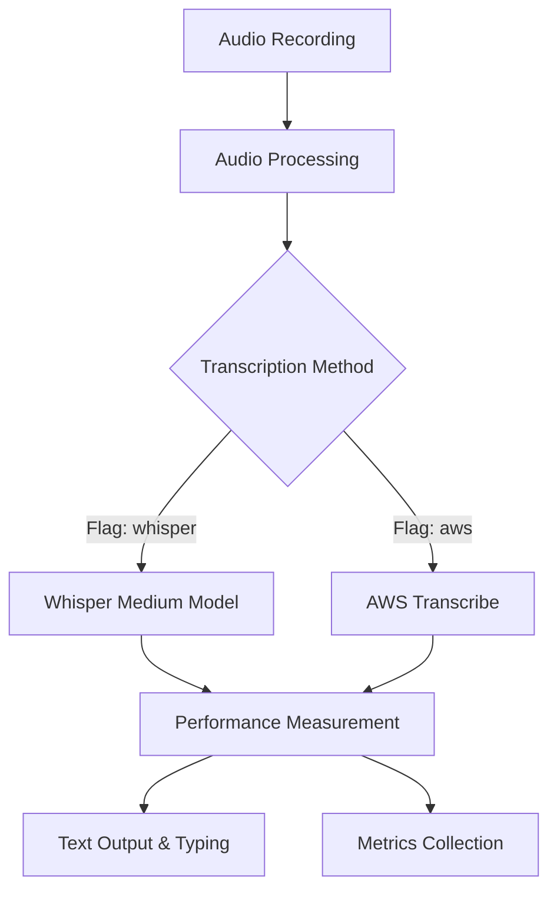

# AWS Transcribe vs Whisper Performance Comparison POC

## Overview
Create a Proof of Concept to integrate AWS Transcribe alongside the existing Whisper medium model setup, enabling direct performance comparison with real audio data.

## Current State Analysis
- **Existing Model**: Medium Whisper model (good accuracy, moderate speed)
- **Architecture**: Local processing, offline-first design
- **Audio Format**: 16kHz, 16-bit, mono PCM
- **Max Recording**: 30 seconds default
- **Integration**: Tight coupling between recording, transcription, and text output

## POC Objectives
1. **🎯 Primary Goal**: Measure and compare transcription speed between Whisper medium and AWS Transcribe
2. **🔄 Maintain Compatibility**: Keep existing Whisper functionality intact
3. **⚡ Performance Metrics**: Capture detailed timing data for analysis
4. **🚀 Feature Flag**: Allow runtime switching between transcription methods
5. **📊 Data Collection**: Generate comparison reports for decision making

## Technical Architecture

### Phase 1: Core Integration (Priority 1) 🚀


#### 1.1 Enhanced SpeechTranscriber Class
- **Current**: Single `transcribe()` method using Whisper
- **Enhanced**: Abstract interface with multiple implementations
- **Timing**: Wrap both methods with precise timing measurement
- **Error Handling**: Graceful fallback and error reporting

#### 1.2 AWS Transcribe Integration
- **Service**: AWS Transcribe (batch mode for POC simplicity)
- **Audio Format**: Convert existing 16kHz PCM to AWS-compatible format
- **Authentication**: AWS credentials via environment variables or AWS CLI
- **API Choice**: Start with `start_transcription_job` for batch processing

#### 1.3 Configuration Management
- **Feature Flag**: `--transcription-method` CLI argument
- **AWS Settings**: Region, credentials, S3 bucket for audio upload
- **Timing Options**: Enable/disable detailed performance logging

### Phase 2: Performance Measurement (Priority 2) 📊
#### 2.1 Timing Metrics
- **Whisper Timing**: 
  - Model loading time (one-time cost)
  - Audio processing time
  - Transcription time
- **AWS Transcribe Timing**:
  - Audio upload time to S3
  - Transcription job submission time
  - Processing wait time
  - Result retrieval time
  - Total end-to-end time

#### 2.2 Data Collection
- **CSV Export**: Timestamp, method, audio_length, transcription_time, accuracy_notes
- **JSON Logs**: Detailed timing breakdown for analysis
- **Comparison Reports**: Side-by-side performance analysis

### Phase 3: Enhanced Features (Priority 3) ⚡
#### 3.1 Audio Format Optimization
- **Current**: 16kHz, 16-bit, mono PCM
- **AWS Optimization**: Test different formats (MP3, FLAC) for upload efficiency
- **Compression**: Balance quality vs upload speed

#### 3.2 Advanced AWS Features
- **Real-time Streaming**: Explore AWS Transcribe streaming for lower latency
- **Custom Vocabulary**: Test domain-specific accuracy improvements
- **Language Detection**: Automatic language detection vs explicit setting

## Implementation Plan

### Sprint 1: Foundation (Week 1) 🏗️
**Goal**: Basic AWS Transcribe integration working alongside existing Whisper

**Tasks**:
1. **Setup AWS Dependencies** (Day 1)
   - Add boto3 to requirements.txt
   - Create AWS configuration helper
   - Test basic AWS Transcribe connectivity

2. **Refactor Transcription Architecture** (Day 2-3)
   - Create abstract `TranscriptionProvider` interface
   - Implement `WhisperProvider` (wrap existing code)
   - Implement `AWSTranscribeProvider` (basic version)

3. **Integration & Testing** (Day 4-5)
   - Modify main application to use provider pattern
   - Add feature flag for method selection
   - Basic end-to-end testing with both methods

**Deliverables**:
- ✅ Working POC with both transcription methods
- ✅ Command-line flag to switch between methods
- ✅ Basic error handling and logging

### Sprint 2: Performance Measurement (Week 2) 📈
**Goal**: Comprehensive timing and performance comparison

**Tasks**:
1. **Timing Infrastructure** (Day 1-2)
   - Implement precise timing decorators
   - Create performance data collection system
   - Add CSV/JSON export functionality

2. **Benchmarking Suite** (Day 3-4)
   - Create test audio samples of various lengths
   - Automated testing script for both methods
   - Statistical analysis of results

3. **Reporting & Analysis** (Day 5)
   - Generate comparison reports
   - Identify performance patterns
   - Document findings and recommendations

**Deliverables**:
- ✅ Detailed performance comparison data
- ✅ Automated benchmarking tools
- ✅ Analysis report with recommendations

### Sprint 3: Optimization & Polish (Week 3) ✨
**Goal**: Optimize performance and prepare for production consideration

**Tasks**:
1. **Performance Optimization** (Day 1-2)
   - Optimize AWS audio upload process
   - Test different audio formats and compression
   - Implement connection pooling and retries

2. **Enhanced Features** (Day 3-4)
   - Add real-time streaming option for AWS
   - Implement intelligent fallback mechanisms
   - Enhanced error handling and user feedback

3. **Documentation & Handoff** (Day 5)
   - Complete technical documentation
   - Usage guides and configuration examples
   - Recommendations for production deployment

**Deliverables**:
- ✅ Optimized POC ready for extended testing
- ✅ Complete documentation and setup guides
- ✅ Production readiness assessment

## Technical Specifications

### File Structure
```
├── transcription/
│   ├── __init__.py
│   ├── providers/
│   │   ├── __init__.py
│   │   ├── base.py          # Abstract TranscriptionProvider
│   │   ├── whisper_provider.py
│   │   └── aws_provider.py
│   ├── timing.py            # Performance measurement utilities
│   └── config.py            # Configuration management
├── benchmarks/
│   ├── test_audio/          # Sample audio files
│   ├── benchmark.py         # Automated testing script
│   └── analysis.py          # Results analysis
├── requirements.txt         # Updated with boto3
└── whisper_dictation.py     # Modified main application
```

### Key Dependencies
```python
# New dependencies for AWS integration
boto3>=1.26.0
botocore>=1.29.0

# Enhanced timing and analysis
pandas>=1.5.0  # For data analysis
matplotlib>=3.6.0  # For performance visualization
```

### Configuration Options
```bash
# Use Whisper (current default)
python whisper_dictation.py --transcription-method whisper --model_name medium

# Use AWS Transcribe
python whisper_dictation.py --transcription-method aws --aws-region us-west-2

# Benchmark mode (test both methods)
python whisper_dictation.py --benchmark --test-audio benchmarks/test_audio/
```

## Success Criteria
1. **✅ Functional POC**: Both Whisper and AWS Transcribe working seamlessly
2. **📊 Performance Data**: Comprehensive timing comparison across different audio lengths
3. **🔄 Feature Parity**: AWS integration maintains all existing functionality
4. **📈 Measurable Results**: Clear performance winner identified with data
5. **🚀 Production Ready**: Code quality suitable for production deployment

## Risk Mitigation
- **AWS Costs**: Use AWS Free Tier, implement usage monitoring
- **Network Dependencies**: Graceful handling of connectivity issues
- **Audio Format Issues**: Comprehensive format testing and conversion
- **Performance Regression**: Maintain existing Whisper performance as baseline

## Expected Outcomes
Based on typical performance characteristics:
- **Whisper Medium**: ~2-5x real-time processing (varies by hardware)
- **AWS Transcribe**: ~1-3 second network latency + processing time
- **Winner**: Likely depends on audio length and network conditions

The POC will provide definitive data to make an informed architectural decision.